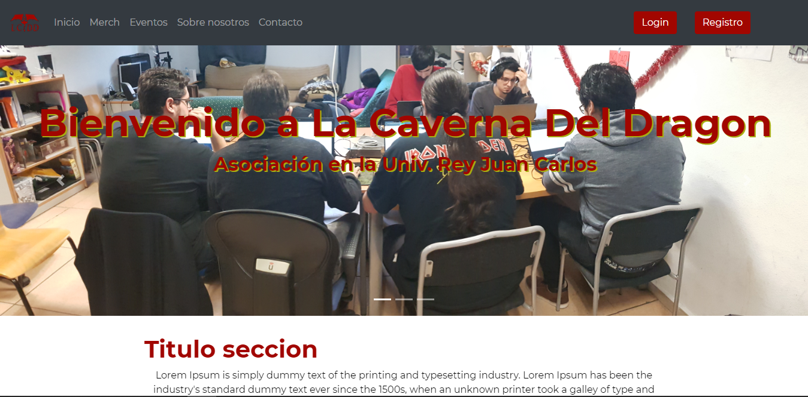
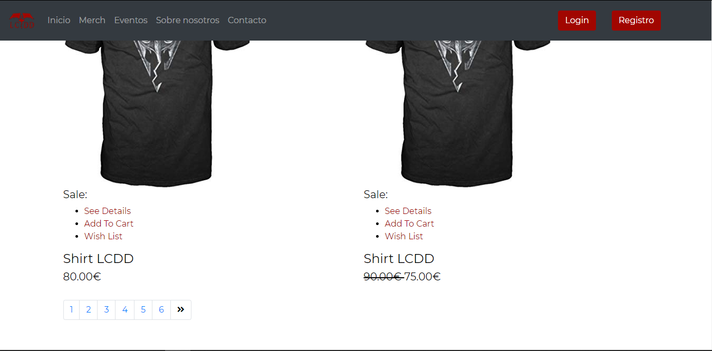
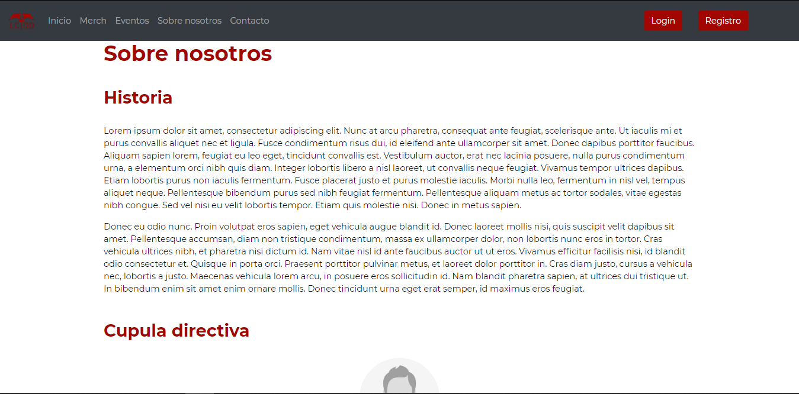
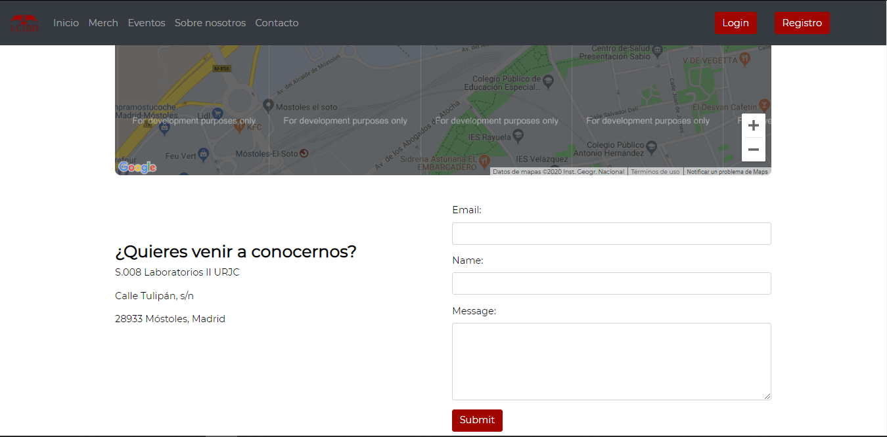
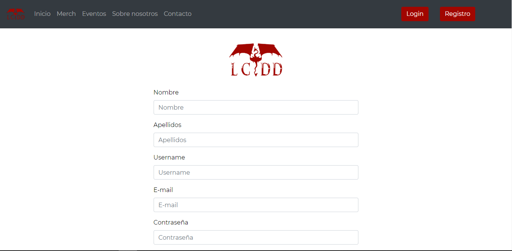
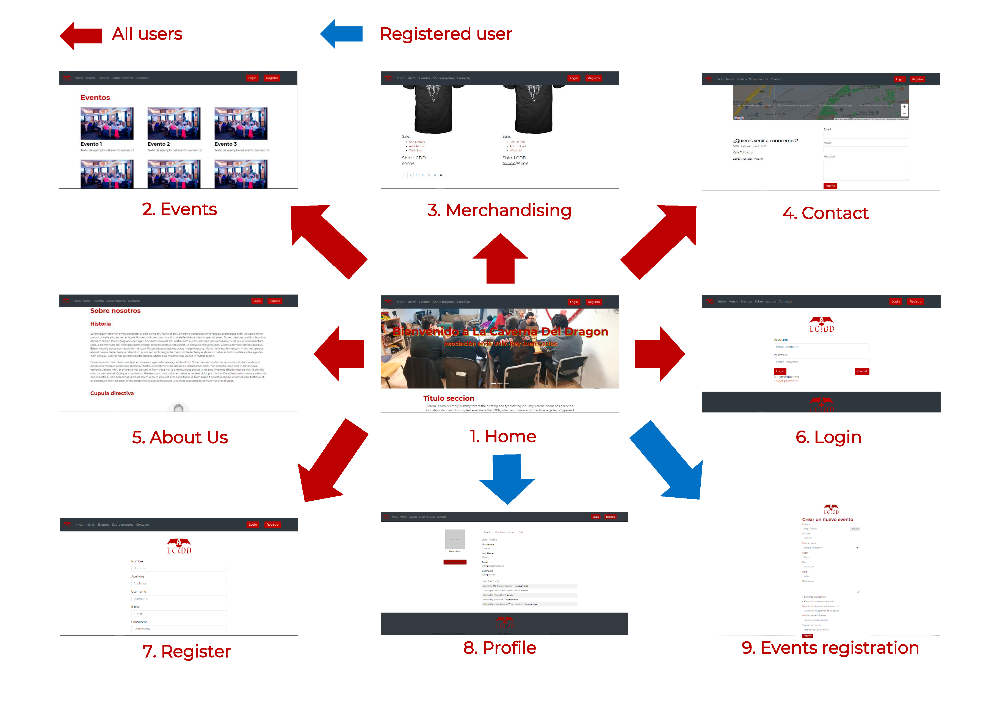
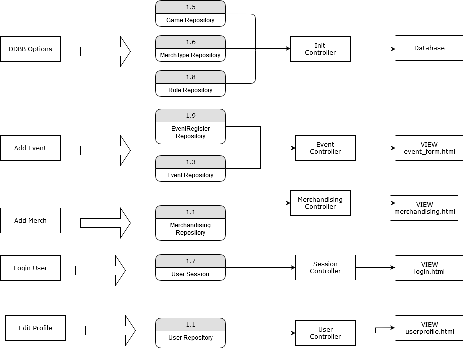

# WEB APP GROUP 5

Project developed as an assignment for Web Application Development subject, Software Engineering degree.
Rey Juan Carlos University 2019/2020

Development off a web application for La Caverna del Dragon association (URJC - Mostoles).

## PHASE 0: Project attributes

## Developer team
| Name	| Email	| User |
|-------|-------|--------|
| Alfonso Pajuelo Aguirre	| va.pajuelo@alumnos.urjc.es	| alfonsopajueloaguirre |
| Carlos Palomares Becerra	| c.palomaresb@alumnos.urjc.es	| carlospabe |
| Daniel Moreno Godoy		| d.moreno.2016@alumnos.urjc.es	| Danielmg21 |
| Miguel Jiménez Granizo	| m.jimenezgra@alumnos.urjc.es	| byGranizo |
| Óscar Rivas Melar         | o.rivas.2017@alumnos.urjc.es 	| oscar-llury |

- Project's trello board: https://trello.com/b/3Y1kgUPj/

### Project description
**Entities:**
* Events: date, location, game rules and team quota.
* Merchandising: price, delivery and products availability.
* Registered user: profiles and preferences.
* Administration user: administration permissions and tools.

**User's role and permissions:**
- Registered users that belong to the association:
  - President and vicepresident: association's members permisisions and responsabilities managment  
  - Secretary: events and tournaments managment.
  - Treasurer: accounts manager and merchandising store managment.
  - Board member: site maintenance and user support.
- Registered user: profile and preferences managment, join events and purchase merchandising.
- Visitors: browse the website

**Complementary tecnology:**
* Bootstrap for responsive style.
* ChartJS for diagram designs.
* Subscribe to the newsletter.
* Contact block by application form.
* Event location by google maps.

**Advanced query or algorithm:**
Based on user's purchases and inscripted activites, they will recieve a mail about new events according to their preferences.

## PHASE 1: Website structure by HTML and CSS
**Table of contents**:
  - Main page: presentation of the website.
  
  
 - Merchandising: shows products details to every user and let registered users to make purchases.
  
  
 - Events: allows users to check event's details and registered users to submit their attendance.
  
  
  - About us: information about our history and leadership.
  
  
  - Contact: association main contact details.
  
  
  - Login: credentials log screen.
  
  
  - Register: creates a new user profile and credentials.
  
  
 - Profile: shows user information.
  
  
 - Events registration: submit an user event attendance.
  

  - Management: exclusive to registered user that belong to the association.
  
  
**Navigation Diagram**: 

## PHASE 2: Web with HTML generated by servidor and AJAX
### Development direction
- Repository: Github/webapp5
- Development tools: Visual Studio Code, Spring Tool Suite4, Eclipse.
- Dependencies: MySQL Workbench
- To be able to execute the files included in this repository yo should follow the next steps:
1. Open the project in Spring Tool Suite4.
2. Start a service MySQL in the local host 3306, we recommend using XAMPP.
3. Start a connection with de database from the ip: 127.0.0.1 in the port: 3306 with the user "root"and without password. We recomend using MySQL Workbench.
4. (RECOMENDED) In Spring, right click over the root project folder > Maven > Update Project
5. Start running the applicattion from Spring by Spring Boot App.
6. Enter from a browser to: https://localhost:8443

### Diagrams
**Navigation Diagram**:

**Data Base Diagram**

**Class-Template Diagram**

### Members participation

**Miguel**

- Tareas realizadas:

Creación del proyecto Spring, generación de las clases "Entity" para la base de datos y de su previo modelado. Integración de componentes y creacion del dashboard de admin. Certificacion https y puerto 8443.

- 5 comits más significativos:
1. Pojo classers + Session
2. Added https and secure config class
3. All adapted to db, Lasting relations
4. Header and footer as components + session controlle + header user menu
5. dashboard example
- 5 ficheros con participación:
1. dashboard.html
2. header.html
3. dashboard.js
4. DashboardControllerjava
5. package com.lcdd.backend.pojo

**Daniel**

- Tareas realizadas:

Generar los formularios de event y merchandaising.Configurar los roles de usuario de la aplicación. Configuración de la seguridad al acceder a la base de datos.

- 5 comits más significativos:
1. Added register event view
2. Inserted event-form in backend
3. Added data base user roles
4. Added CSRFconfig
5. Fixed errors in security classes
- 5 ficheros con participación:
1. merch-form.html
2. event-form.html
3. SecurityConfiguration.java
4. CSRFHandlerConfiguration
5. UserRepositoryAuthenticationProvider

**Carlos**

- Tareas realizadas:

Implementación de una función para el botón "Mostrar más" de las páginas de Eventos y Merchandising. Edición de imágenes de muestra para las assets. Redacción de textos para la sección "about_us".

- 5 comits más significativos:
1. fix not showing multiple times
2. updated event images
3. scrolling into show more button
4. early version of the feature (showMore)
5. removed scroll to button functionality
- 5 ficheros con participación:
1. events.html
2. about_us.html
3. merchandising.html

**Oscar**

- Tareas realizadas:

Generar la plantilla de información de eventos que se rellena a partir de los datos de un formulario. Convertir todas las páginas html estaticas en tlantillas para incluir el head, nav y footer como componentes. Crear la página de error y configurarla para que sustituya a la "white error page".

- 5 comits más significativos:
1. event-form done, remining event-template
2. updates, remaining photo, id, game, isTorunament (also added display none/block to Premio)
3. created page 404
4. changes in templates and html
5. all pages converted to templates with head and footer in components
- 5 ficheros con participación:
1. event-template.html
2. event-form.html
3. (page)Controller.java
4. Event.java
5. error.html

**Alfonso**

- Tareas realizadas:

Paginacion y mostrar mas de merchandising, convertir la vista de usuario en template, implementar la logica del usuario para su edicion posteriormente a la creacion del perfil.

- 5 comits más significativos:
1. Implemented User Profile Logic
2. Repository and User Controllers
3. Updated Diagramns and Assets
4. Added More Merch Types
5. Show More Feature
- 5 ficheros con participación:
1. merchandising.html
2. user_view.html
3. user-form.html
4. User.java
5. UserController.java

## PHASE 3: API REST to the web application and docker deployment

## PHASE 4: Web with SPA architecture

* Subscribe to the newsletter.
* Contact block by application form.
* Event location by google maps.

**Advanced query or algorithm:**
Based on user's purchases and inscripted activites, they will recieve a mail about new events according to their preferences.

## PHASE 1: Website structure by HTML and CSS
**Table of contents**:
  - Main page: presentation of the website.
  
  
 - Merchandising: shows products details to every user and let registered users to make purchases.
  
  
 - Events: allows users to check event's details and registered users to submit their attendance.
  
  
  - About us: information about our history and leadership.
  
  
  - Contact: association main contact details.
  
  
  - Login: credentials log screen.
  
  
  - Register: creates a new user profile and credentials.
  
  
 - Profile: shows user information.
  
  
 - Events registration: submit an user event attendance.
  

  - Management: exclusive to registered user that belong to the association.
  
  
**Navigation Diagram**: 

## PHASE 2: Web with HTML generated by servidor and AJAX

## PHASE 3: API REST to the web application and docker deployment

## PHASE 4: Web with SPA architecture
