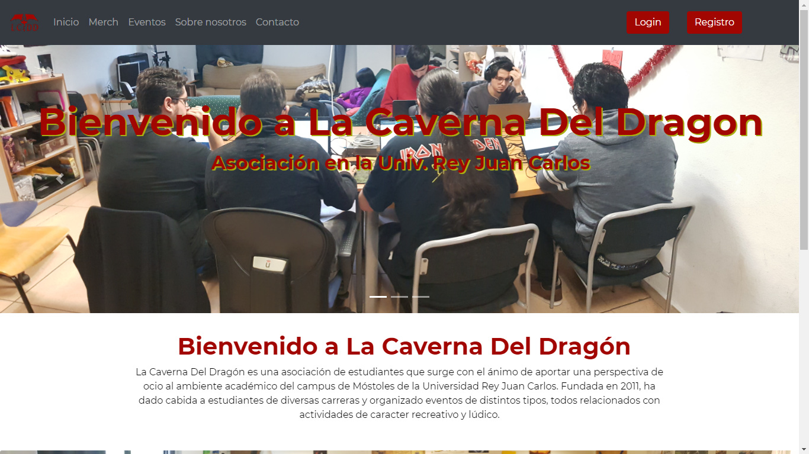
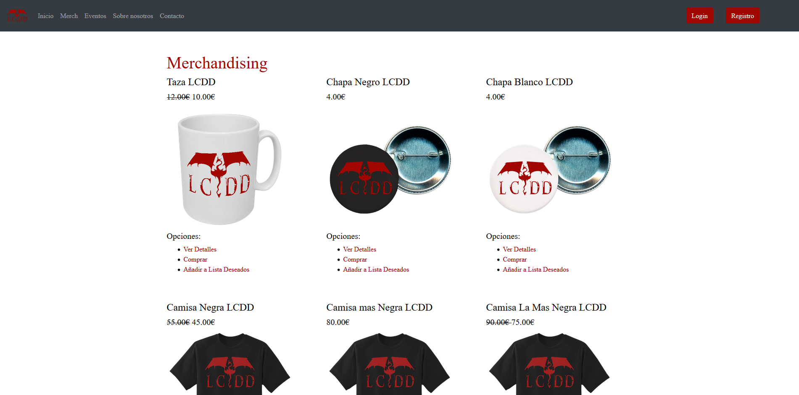
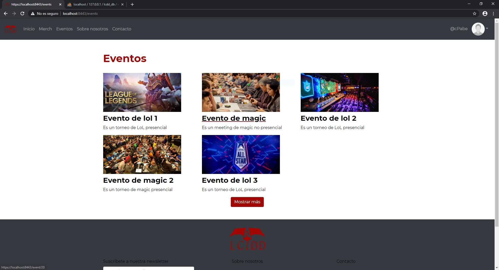
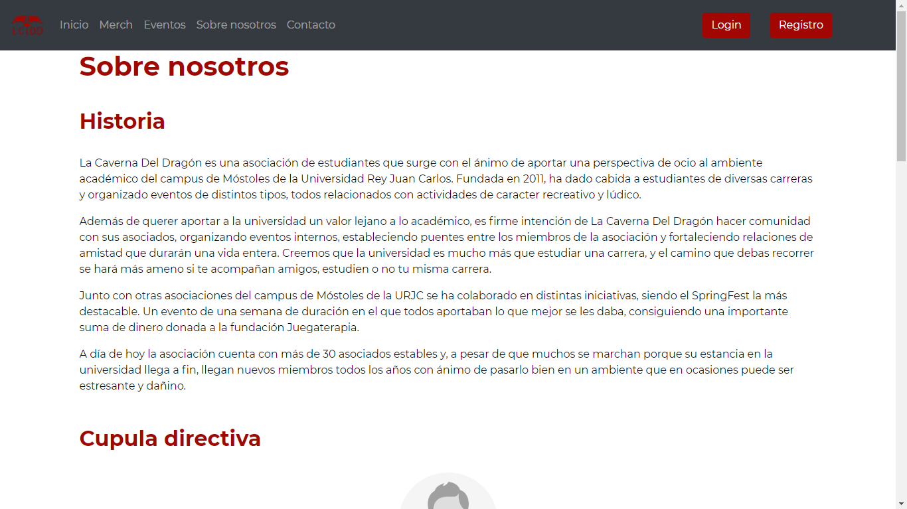
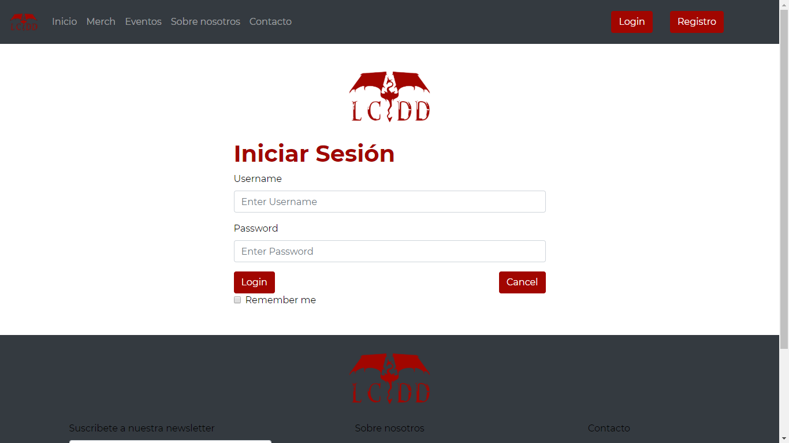
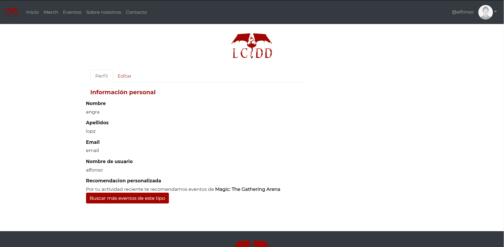

# WEB APP GROUP 5

Project developed as an assignment for Web Application Development subject, Software Engineering degree.
Rey Juan Carlos University 2019/2020

Development off a web application for La Caverna del Dragon association (URJC - Mostoles).

## PHASE 0: Project attributes

## Developer team
| Name	| Email	| User |
|-------|-------|--------|
| Alfonso Pajuelo Aguirre	| va.pajuelo@alumnos.urjc.es	| alfonsopajueloaguirre |
| Carlos Palomares Becerra	| c.palomaresb@alumnos.urjc.es	| carlospabe |
| Daniel Moreno Godoy		| d.moreno.2016@alumnos.urjc.es	| Danielmg21 |
| Miguel Jiménez Granizo	| m.jimenezgra@alumnos.urjc.es	| byGranizo |
| Óscar Rivas Melar         | o.rivas.2017@alumnos.urjc.es 	| oscar-llury |

- Project's trello board: https://trello.com/b/3Y1kgUPj/

### Project description
**Entities:**
* Events: date, location, game rules and team quota.
* Merchandising: price, delivery and products availability.
* Registered user: profiles and preferences.
* Administration user: administration permissions and tools.

**User's role and permissions:**
- Registered users that belong to the association:
  - President and vicepresident: association's members permisisions and responsabilities managment  
  - Secretary: events and tournaments managment.
  - Treasurer: accounts manager and merchandising store managment.
  - Board member: site maintenance and user support.
- Registered user: profile and preferences managment, join events and purchase merchandising.
- Visitors: browse the website

**Complementary tecnology:**
* Bootstrap for responsive style.
* ChartJS for diagram designs.
* Subscribe to the newsletter.
* Contact block by application form.
* Event location by google maps.

**Advanced query or algorithm:**
Based on user's purchases and inscripted activites, they will recieve a mail about new events according to their preferences.
  
## PHASE 1: Website structure by HTML and CSS
  
**Table of contents**:
  - Main page: presentation of the website.
  
  
  - Merchandising: shows all merchandising products.
  
  
  - Merchandising product: shows more details of a merchandising product and let registered users to make purchases.
  
  
  - Events: shows all events.
  
 
  - Event : allows users to check event's details and registered users to submit their attendance.
  
  
  - About us: information about our history and leadership.
  
  
  - Contact: association main contact details.
  
  
  - Login: credentials log screen.
  
  
  - Register: creates a new user profile and credentials.
  
  
  - Profile: shows user information.
  
  
  - Profile edit: permit user to show and edit him personal information.
  
 
  - Error page: personalized error page.
  
  
  - Management admin: exclusive to change user roles that belong to the association.
  

  - Management events: exclusive to show user inscriptions and all events rates.
  
  
  - Management merchandising: exclusive to show user purchases and all merchandising rates.
  
  
  - Management events register: exclusive to register a new event.
  
  
  - Management merchandising register: exclusive to register a new merchandising.
  
  
**Navigation Diagram**: 

## PHASE 2: Web with HTML generated by servidor and AJAX

### Development direction

- Repository: Github/webapp5
- Development tools: Visual Studio Code, Spring Tool Suite4, Eclipse.
- Dependencies: MySQL Workbench
- To be able to execute the files included in this repository yo should follow the next steps:
1. Open the project in Spring Tool Suite4.
2. Start a service MySQL in the local host 3306, we recommend using XAMPP.
3. Start a connection with de database from the ip: 127.0.0.1 in the port: 3306 with the user "root"and without password. We recomend using MySQL Workbench.
4. (RECOMENDED) In Spring, right click over the root project folder > Maven > Update Project
5. Start running the applicattion from Spring by Spring Boot App.
6. Enter from a browser to: https://localhost:8443

### Diagrams

**Navigation Diagram for public pages**:

**Navigation Diagram for private pages**:

**Data Base Diagram**

**Class-Template Diagram**

### Members participation

**Miguel**

- Completed tasks: creation of the Spring project, generation of the "Entity" classes for the database and its previous modeling. Integration of components and creation of the admin dashboard. Certification https and port 8443.

- 5 most significant comics:
  1. Pojo classers + Session
  2. Added https and secure config class
  3. All adapted to db, Lasting relations
  4. Header and footer as components + session controlle + header user menu
  5. dashboard example
  
- 5 files with participation:
  1. dashboard.html
  2. header.html
  3. dashboard.js
  4. DashboardControllerjava
  5. package com.lcdd.backend.pojo

**Daniel**

-  Completed tasks: generate the event and merchandaising templates forms. Configure the user roles of the application. Security configuration when accessing the database.

- 5 most significant comics:
  1. Added register event view
  2. Inserted event-form in backend
  3. Added data base user roles
  4. Added CSRFconfig
  5. Fixed errors in security classes
  
- 5 files with participation:
  1. merch-form.html
  2. event-form.html
  3. SecurityConfiguration.java
  4. CSRFHandlerConfiguration
  5. UserRepositoryAuthenticationProvider

**Carlos**

- Completed tasks: implementation of a function for the "Show more" button on the Events and Merchandising pages. Sample image editing for assets. Text writing for all web.

- 5 most significant comics:
1. fix not showing multiple times
2. updated event images
3. scrolling into show more button
4. early version of the feature (showMore)
5. removed scroll to button functionality

- 5 files with participation:
1. events.html
2. about_us.html
3. merchandising.html

**Óscar**

- Completed tasks: generate the event more information template that is filled from the form data template and its java controllers. Convert all static html pages into templates, also include the head, nav and footer as components. Create the error page and configure it to replace the "white error page".

- 5 most significant comics:
  1. event-form done, remining event-template
  2. updates, remaining photo, id, game, isTorunament (also added display none/block to Premio)
  3. created page 404
  4. changes in templates and html
  5. all pages converted to templates with head and footer in components

- 5 files with participation:
  1. event-template.html
  2. event-form.html
  3. (page)Controller.java
  4. Event.java
  5. error.html

**Alfonso**

- Completed tasks: pagination and show more merchandising, convert the user view into a template, implement the user's logic for editing after the creation of the profile.

- 5 most significant comics:
  1. Implemented User Profile Logic
  2. Repository and User Controllers
  3. Updated Diagramns and Assets
  4. Added More Merch Types
  5. Show More Feature

- 5 files with participation:
  1. merchandising.html
  2. user_view.html
  3. user-form.html
  4. User.java
  5. UserController.java

## PHASE 3: API REST to the web application and docker deployment

## PHASE 4: Web with SPA architecture
